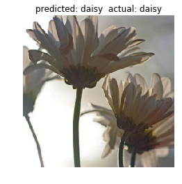
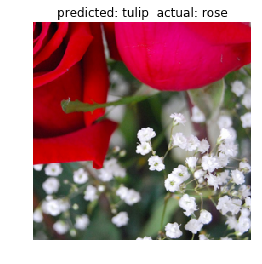
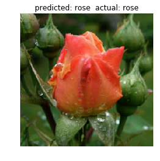

## Using Transfer Learning to achieve > 80% accuracy on a dataset of less than 1000 images

Using state of the art **DensetNet** architecture for object recognition as a pretrained model and *Pytorch* library for Deep Learning, I showcased the use of *Transfer Learning* by replacing the last fully connected linear layer with another fc layer with the number of output features = 5 classes as per our use case. All the previous layers were frozen and the network trained on our dataset updating only the weights of the last layer. As a result, I was able to achieve **89.3%** accuracy on the Training set and **82.2%** accuracy on the Validation Set within only 15 epochs.

## Dataset

I used the dataset called 'Flowers Recognition'. This dataset consists of 5 classes of flowers - **daisy, dandelion, rose, sunflower and tulip**. It contains 4242 images of flowers, but for the purposes of this Task, I reduced the number of images to 950 images (747 in training dataset and 203 in validation dataset).

https://www.kaggle.com/alxmamaev/flowers-recognition

## Data Loading

I used the *torchvision*.*datasets* module of the *torchvision* package to transform the raw flowers dataset to tensors which can be used as an input to the model.

Using *DataLoader* package of *torch.utils*, I converted the dataset into a data loader object which outputs batches of images to the model for faster training

## Model and Training

Using *torchvision.datasets*, I loaded a pretrained model based on *DenseNet* architecture. I froze all the weights parameter of the network using *requires_grad = False*. The last layer of fully connected layer with 1000 output features was converted into a fc layer of 5 output features corresponding to our dataset of 5 classes. For this layer *requires_grad* was kept to  *True* to unfreeze the layer so that its weights will be trainable.

The Loss function used is *CrossEntropyLoss* for categorical variables.
The optimizer used is Stochastic Gradient Descent.
Number of epochs for training = 15
Batch Size for the dataset loader = 10

## Results

Here are some of the results after the training  from the validation dataset

  

Best Validation Accuracy = 82.2%
Best Training Accuracy = 89.3%

### References 

https://pytorch.org/docs/stable/torchvision/models.html

Thank You,

Navpreet Singh
